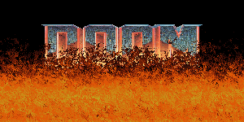

# Doom-Fire-Effect-Fogo-do-Doom-
Efeito de fogo do Doom, feito na aula do Filipe Deschamps

## Descrição do projeto:
Efeito de fogo do Doom em JavaScript, feito na aula do Filipe Deschamps.

DOOM - Doom é uma série de jogos eletrônicos de tiro em primeira pessoa desenvolvida pela id Software. A série gira em torno das aventuras de um fuzileiro espacial sem nome que trabalha para o UAC, que luta contra legiões de demônios e mortos - vivos, a fim de sobreviver e posterioente, na história, salvar a raça humana.

**Para executar o projeto, basta clicar no arquivo:**
> `index` 

## Vídeo do Fogo sendo Executado:
- https://www.youtube.com/watch?v=MvAykPpfpb4

## Pré-requisitos:
O programa roda em qualquer navegador.

### Dev By:
Felipe Cardoso
